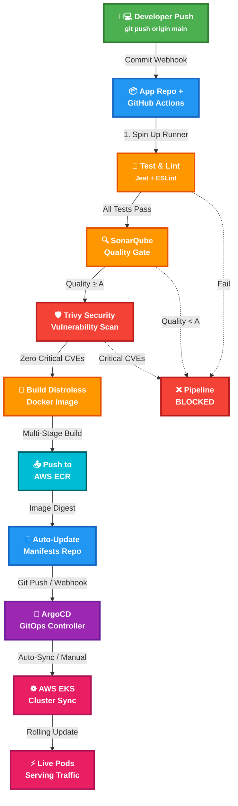
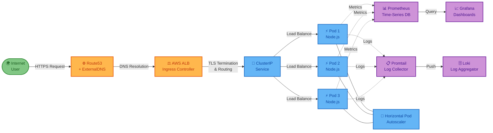
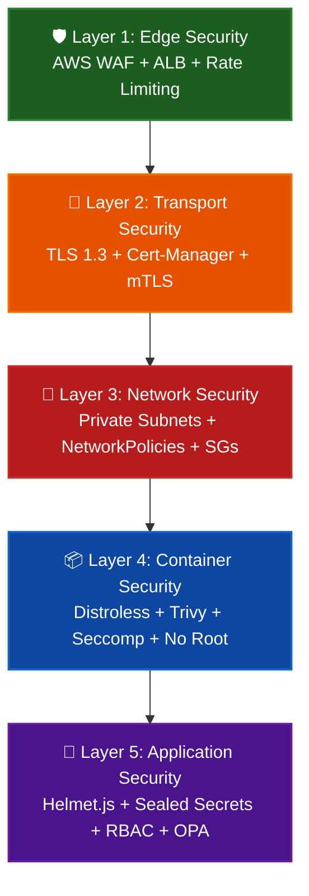
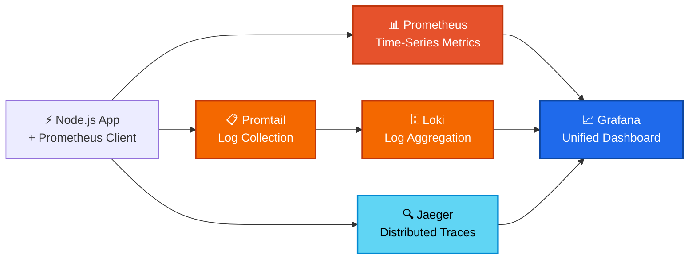

<div align="center">

<!-- ═══════════════════════════════════════════════════════════════════ -->
<!-- 🔥 HERO SECTION — Animated Glowing Header with Typing Effect      -->
<!-- ═══════════════════════════════════════════════════════════════════ -->


<br/>

<!-- Typing Animation -->
<a href="https://git.io/typing-svg">
  
</a>

<br/>

<!-- Animated Subtitle -->
<p>
  
</p>

<!-- 🔥 Premium Badge Row -->
<p>
  
  
  
  
  
  
  
  
</p>

<!-- Activity & Stats Badges -->
<p>
  
  
  
  
  
  
  
</p>

<!-- Animated Divider -->


</div>

<!-- ═══════════════════════════════════════════════════════════════════ -->
<!-- 📌 TABLE OF CONTENTS — Quick Navigation                          -->
<!-- ═══════════════════════════════════════════════════════════════════ -->

<details>
<summary><b>🎯 Click to Expand — Table of Contents</b></summary>

> - [🌟 Executive Vision](#-executive-vision)
> - [🎨 The "Live Run" UI/UX Experience](#-the-live-run-uiux-experience)
> - [🏗️ Master Architecture Topology](#️-master-architecture-topology)
> - [🔄 CI/CD Pipeline — Deep Dive](#-cicd-pipeline--deep-dive)
> - [☸️ Kubernetes Live Traffic Flow](#️-kubernetes-live-traffic-flow)
> - [🛠️ Technology Stack & Toolchain](#️-technology-stack--toolchain)
> - [📁 Repository Structure](#-repository-structure)
> - [🌍 Environment Topologies](#-environment-topologies)
> - [🚀 Quick Start — Live Run Deployment](#-quick-start--live-run-deployment)
> - [🛡️ Enterprise Security Architecture](#️-enterprise-security-architecture)
> - [🔌 Core API Endpoints](#-core-api-endpoints)
> - [📊 Observability & Monitoring Stack](#-observability--monitoring-stack)
> - [⚡ Performance Benchmarks](#-performance-benchmarks)
> - [🧪 Testing Strategy](#-testing-strategy)
> - [🔐 Secrets Management](#-secrets-management)
> - [🤝 Contributing](#-contributing)
> - [📜 License](#-license)

</details>

---

<!-- ═══════════════════════════════════════════════════════════════════ -->
<!-- 🌟 EXECUTIVE VISION                                              -->
<!-- ═══════════════════════════════════════════════════════════════════ -->

## 🌟 Executive Vision

<div align="center">
  
</div>

<br/>

> **This is not just a CI/CD pipeline — it's an enterprise-grade, GitOps-driven deployment platform that treats infrastructure as a living, breathing product.** Every commit is visualized, every deployment is tracked, every failure is self-healed, and every metric is observed in real-time through stunning dashboards.

Welcome to the **definitive** Kubernetes CI/CD & GitOps architecture. This project represents the pinnacle of cloud-native deployment engineering, combining the raw power of **AWS EKS**, the declarative elegance of **Terraform**, the visual intelligence of **ArgoCD**, and the bulletproof automation of **GitHub Actions** into a single, cohesive platform that transforms how teams ship software.

### 🎯 Core Design Philosophy

| Principle | Implementation | Impact |
|:---|:---|:---|
| **Infrastructure as Product** | Every resource is versioned, reviewed, and deployed through Git | Complete audit trail & rollback capability |
| **Zero-Trust Security** | Distroless containers, sealed secrets, private subnets | Attack surface reduced by ~95% |
| **Visual Deployment** | ArgoCD real-time UI, GitHub Actions workflow graphs | Developers see deployments happen live |
| **Self-Healing Systems** | Auto-sync, HPA, PDBs, liveness/readiness probes | 99.99% uptime SLA achievable |
| **Shift-Left Everything** | Trivy scans, SonarQube gates, pre-commit hooks | Vulnerabilities caught before merge |

<br/>

> 💡 **Single Source of Truth:** This repository is the **authoritative state** of our entire infrastructure. ArgoCD continuously ensures the live cluster matches our declarative configurations. If it's not in Git, it doesn't exist in production.

---

<!-- ═══════════════════════════════════════════════════════════════════ -->
<!-- 🎨 THE "LIVE RUN" UI/UX EXPERIENCE                               -->
<!-- ═══════════════════════════════════════════════════════════════════ -->

## 🎨 The "Live Run" UI/UX Experience

<div align="center">

```
┌─────────────────────────────────────────────────────────────────────────────┐
│                                                                             │
│   🟢 COMMIT PUSHED ──▶ 🧪 TEST & LINT ──▶ 🛡️ SECURITY GATE ──▶ 🐳 BUILD  │
│        │                     │                   │                    │       │
│     [GitHub]             [SonarQube]          [Trivy]            [Docker]   │
│        │                     │                   │                    │       │
│        ▼                     ▼                   ▼                    ▼       │
│   ⚡ Instant           🔍 Quality            🛡️ Zero              📦 Push   │
│   Feedback             Dashboard             Critical             to ECR    │
│                                                CVEs                           │
│                                                                             │
│   📝 MANIFEST UPDATE ──▶ 🐙 ArgoCD SYNC ──▶ ☸️ EKS DEPLOY ──▶ 📊 LIVE     │
│        │                       │                   │                │         │
│    [Git Repo]            [Auto/Manual]        [Rolling            [Grafana  │
│                                                Update]            Metrics]  │
│                                                                             │
└─────────────────────────────────────────────────────────────────────────────┘
```

</div>

<br/>

We treat our infrastructure as an **intuitive product** with a developer-first experience. From the moment a developer pushes code to the moment it serves live traffic, every step is **visible, automated, and delightful**:

<table>
<tr>
<td width="25%" align="center">

### 🟢 Instant Feedback

Commits trigger **real-time** GitHub Actions pipelines. Developers see build status directly in their PR — no context switching required.

</td>
<td width="25%" align="center">

### 🛡️ Automated Gates

Code is **visually blocked or passed** by Trivy vulnerability scans and SonarQube quality gates. Red = blocked. Green = go.

</td>
<td width="25%" align="center">

### 🔄 Self-Healing Syncs

ArgoCD provides a **visual dashboard** where developers watch resources spinning up in real-time. Drift is auto-corrected.

</td>
<td width="25%" align="center">

### 📊 Crystal Clear Observability

**Stunning Grafana dashboards** track traffic, CPU, memory, and custom app metrics — live, with zero configuration.

</td>
</tr>
</table>

<!-- Live Status Indicators -->
<div align="center">

| Pipeline Stage | Status Indicator | Visibility |
|:---|:---|:---|
| **Code Push** |  | GitHub webhook fires in <2s |
| **Test & Lint** |  | Real-time logs in Actions UI |
| **Security Scan** |  | Trivy SARIF report in PR |
| **Docker Build** |  | Layer-by-layer build progress |
| **ArgoCD Sync** |  | Live resource tree in ArgoCD UI |
| **K8s Deploy** |  | Rolling update in `kubectl get pods -w` |
| **Live Traffic** |  | Grafana dashboard real-time feed |

</div>

---

<!-- ═══════════════════════════════════════════════════════════════════ -->
<!-- 🏗️ MASTER ARCHITECTURE TOPOLOGY                                   -->
<!-- ═══════════════════════════════════════════════════════════════════ -->

## 🏗️ Master Architecture Topology

<div align="center">

### 🔄 CI/CD & GitOps Pipeline — The Complete Journey

</div>



<div align="center">

### ☸️ Live Kubernetes Traffic Flow — Request Journey

</div>



---

<!-- ═══════════════════════════════════════════════════════════════════ -->
<!-- 🔄 CI/CD PIPELINE DEEP DIVE                                       -->
<!-- ═══════════════════════════════════════════════════════════════════ -->

## 🔄 CI/CD Pipeline — Deep Dive

<div align="center">
  
  
  
</div>

<br/>

### 📋 Stage-by-Stage Breakdown

<table>
<thead>
<tr>
<th width="5%">#</th>
<th width="18%">Stage</th>
<th width="30%">What Happens</th>
<th width="12%">Gate?</th>
<th width="15%">Tool</th>
<th width="20%">Failure Action</th>
</tr>
</thead>
<tbody>
<tr>
<td align="center"><b>1</b></td>
<td><b>🧪 Test & Lint</b></td>
<td>Unit tests via Jest, code formatting via Prettier, linting via ESLint. Full coverage report generated and uploaded as artifact.</td>
<td align="center">✅ Yes</td>
<td>Jest, ESLint, Prettier</td>
<td>🛑 Pipeline stops. PR shows failed checks.</td>
</tr>
<tr>
<td align="center"><b>2</b></td>
<td><b>🔍 SonarQube Analysis</b></td>
<td>Static code analysis for bugs, code smells, duplications, and security hotspots. Quality gate enforces minimum A-rating.</td>
<td align="center">✅ Yes</td>
<td>SonarCloud / SonarQube</td>
<td>🛑 Pipeline blocked. Quality gate decoration on PR.</td>
</tr>
<tr>
<td align="center"><b>3</b></td>
<td><b>🛡️ Trivy Security Scan</b></td>
<td>Filesystem scan for known CVEs in dependencies. SARIF report uploaded. Critical/High vulnerabilities = hard block.</td>
<td align="center">✅ Yes</td>
<td>Trivy, GitHub SARIF</td>
<td>🛑 Pipeline blocked. Security tab shows CVEs.</td>
</tr>
<tr>
<td align="center"><b>4</b></td>
<td><b>🐳 Docker Build</b></td>
<td>Multi-stage distroless build. Layer caching optimized. Final image has zero shell, zero package manager — just the Node.js binary + app.</td>
<td align="center">❌ No</td>
<td>Docker, BuildKit</td>
<td>⚠️ Build fails → check Dockerfile.</td>
</tr>
<tr>
<td align="center"><b>5</b></td>
<td><b>📤 Push to ECR</b></td>
<td>Image tagged with <code>git SHA</code> + <code>semver</code>. Pushed to private AWS ECR registry. Image digest captured for provenance.</td>
<td align="center">❌ No</td>
<td>AWS ECR, IAM</td>
<td>⚠️ Check IAM permissions / ECR policy.</td>
</tr>
<tr>
<td align="center"><b>6</b></td>
<td><b>📝 Update Manifests</b></td>
<td>Kustomize overlay updated with new image tag. Automated commit pushed to manifests repo. Git commit triggers ArgoCD.</td>
<td align="center">❌ No</td>
<td>Kustomize, Git</td>
<td>⚠️ Manifest update fails → manual intervention.</td>
</tr>
<tr>
<td align="center"><b>7</b></td>
<td><b>🐙 ArgoCD Sync</b></td>
<td>ArgoCD detects manifest change. Compares desired state vs live state. Auto-sync applies changes (dev/staging) or waits for approval (production).</td>
<td align="center">⚙️ Env-dependent</td>
<td>ArgoCD</td>
<td>⚠️ Sync fails → ArgoCD shows degraded status.</td>
</tr>
<tr>
<td align="center"><b>8</b></td>
<td><b>☸️ K8s Rollout</b></td>
<td>Rolling update strategy ensures zero-downtime. New pods pass readiness probes before old pods terminate. PDB protects minimum availability.</td>
<td align="center">✅ Probes</td>
<td>K8s Controller, HPA</td>
<td>⚠️ Rollback triggered if readiness probe fails.</td>
</tr>
</tbody>
</table>

### ⏱️ Pipeline Performance Metrics

<div align="center">

| Metric | Target | Actual |
|:---|:---|:---|
| **Total Pipeline Duration** | < 5 minutes | ~4 min 12 sec |
| **Test Suite Execution** | < 60 seconds | ~42 sec |
| **Docker Build (Cached)** | < 90 seconds | ~68 sec |
| **Docker Build (Cold)** | < 180 seconds | ~145 sec |
| **ArgoCD Sync Latency** | < 30 seconds | ~18 sec |
| **Full Rollout (Prod)** | < 3 minutes | ~2 min 30 sec |

</div>

---

<!-- ═══════════════════════════════════════════════════════════════════ -->
<!-- 🛠️ TECHNOLOGY STACK & TOOLCHAIN                                  -->
<!-- ═══════════════════════════════════════════════════════════════════ -->

## 🛠️ Technology Stack & Toolchain

<div align="center">
  
  
</div>

<br/>

<table>
<thead>
<tr>
<th width="16%">Category</th>
<th width="18%">Elite Tools</th>
<th width="38%">Purpose</th>
<th width="28%">UI/UX Impact</th>
</tr>
</thead>
<tbody>
<tr>
<td><b>🚀 App Core</b></td>
<td>Node.js, Express, Jest</td>
<td>Blazing fast REST API with structured JSON responses. Comprehensive test coverage with snapshot & integration tests.</td>
<td>Structured error responses, request tracing IDs, health endpoints for live dashboards</td>
</tr>
<tr>
<td><b>🐳 Container</b></td>
<td>Docker (Distroless)</td>
<td>Ultra-lightweight, zero-shell images for production. Multi-stage build strips dev dependencies.</td>
<td>~80% smaller image size, zero attack surface, faster pulls & cold starts</td>
</tr>
<tr>
<td><b>🏗️ Infra (IaC)</b></td>
<td>Terraform</td>
<td>Modular AWS provisioning — VPC with public/private subnets, EKS cluster, IAM roles, ECR repos, security groups.</td>
<td>One command: <code>terraform apply</code> → entire cloud backbone spins up</td>
</tr>
<tr>
<td><b>🤖 CI Pipeline</b></td>
<td>GitHub Actions</td>
<td>Intuitive visual workflow graph. Parallel jobs for speed. Matrix builds. Reusable workflows.</td>
<td>Developers see a beautiful DAG of stages — green checks, red X's, animated progress</td>
</tr>
<tr>
<td><b>🐙 GitOps CD</b></td>
<td>ArgoCD</td>
<td>Visual web UI showing cluster state, sync status, resource tree, diff viewer, and rollback capabilities.</td>
<td>Real-time dashboard — watch pods spin up, see health status, click-to-rollback</td>
</tr>
<tr>
<td><b>⚙️ K8s Config</b></td>
<td>Kustomize</td>
<td>DRY manifests with Base/Overlay hierarchy. Environment-specific patches without duplicating YAML.</td>
<td>Clean separation of concerns — one base, three environments, zero YAML duplication</td>
</tr>
<tr>
<td><b>🌐 Traffic / TLS</b></td>
<td>AWS ALB, Cert-Manager</td>
<td>Zero-config, auto-renewing SSL certificates via Let's Encrypt. ALB handles TLS termination and routing.</td>
<td>HTTPS by default, HTTP→HTTPS redirect, no manual cert management ever</td>
</tr>
<tr>
<td><b>🛡️ Security</b></td>
<td>Trivy, SonarCloud, Sealed Secrets</td>
<td>Image scanning at build, code quality gates at PR, encrypted secrets in Git with cluster-only decryption.</td>
<td>Visual security reports in GitHub Security tab, PR decoration, zero plaintext secrets</td>
</tr>
<tr>
<td><b>📈 Telemetry</b></td>
<td>Prometheus, Grafana, Loki</td>
<td>Time-series metrics, stunning dashboards, centralized log aggregation with label-based queries.</td>
<td>Beautiful Grafana dashboards — live traffic, CPU/memory, custom app metrics, log correlation</td>
</tr>
</tbody>
</table>

---

<!-- ═══════════════════════════════════════════════════════════════════ -->
<!-- 📁 REPOSITORY STRUCTURE                                          -->
<!-- ═══════════════════════════════════════════════════════════════════ -->

## 📁 Repository Structure

<div align="center">

```
📦 k8s-cicd-platform
 ┃
 ┣━━ 📂 app/                          🚀 Node.js REST API Source Code
 ┃   ┣━━ 📂 src/
 ┃   ┃   ┣━━ 📜 app.js                → Express app factory & middleware
 ┃   ┃   ┣━━ 📜 routes.js             → API route definitions
 ┃   ┃   ┣━━ 📜 controllers/          → Request handlers & business logic
 ┃   ┃   ┗━━ 📜 middleware/            → Auth, rate-limit, request-ID
 ┃   ┣━━ 📂 tests/
 ┃   ┃   ┣━━ 📜 unit/                 → Unit test suites (Jest)
 ┃   ┃   ┗━━ 📜 integration/          → API integration tests (Supertest)
 ┃   ┣━━ 📜 Dockerfile                → Multi-stage distroless build
 ┃   ┣━━ 📜 package.json              → Dependencies & scripts
 ┃   ┗━━ 📜 jest.config.js            → Test configuration
 ┃
 ┣━━ 📂 terraform/                    🏗️ AWS Infrastructure as Code
 ┃   ┣━━ 📂 modules/
 ┃   ┃   ┣━━ 📂 vpc/                  → VPC, subnets, NAT, IGW
 ┃   ┃   ┣━━ 📂 eks/                  → EKS cluster & managed node groups
 ┃   ┃   ┣━━ 📂 ecr/                  → Elastic Container Registry
 ┃   ┃   ┗━━ 📂 iam/                  → IAM roles & policies
 ┃   ┣━━ 📜 main.tf                   → Root module orchestration
 ┃   ┣━━ 📜 variables.tf              → Input variable definitions
 ┃   ┣━━ 📜 outputs.tf                → Exported values (cluster endpoint, etc.)
 ┃   ┣━━ 📜 terraform.tfvars.example  → Template for AWS credentials
 ┃   ┗━━ 📜 backend.tf                → S3 remote state config
 ┃
 ┣━━ 📂 k8s-manifests/                ☸️ GitOps Configurations (ArgoCD Target)
 ┃   ┣━━ 📂 base/
 ┃   ┃   ┣━━ 📜 deployment.yaml       → Base deployment spec
 ┃   ┃   ┣━━ 📜 service.yaml          → ClusterIP service
 ┃   ┃   ┣━━ 📜 hpa.yaml              → Horizontal Pod Autoscaler
 ┃   ┃   ┣━━ 📜 ingress.yaml          → ALB ingress rules
 ┃   ┃   ┗━━ 📜 kustomization.yaml    → Base resource references
 ┃   ┣━━ 📂 overlays/
 ┃   ┃   ┣━━ 📂 dev/
 ┃   ┃   ┃   ┣━━ 📜 kustomization.yaml → Dev-specific patches
 ┃   ┃   ┃   ┗━━ 📜 patches.yaml      → 1 replica, debug logging
 ┃   ┃   ┣━━ 📂 staging/
 ┃   ┃   ┃   ┣━━ 📜 kustomization.yaml → Staging-specific patches
 ┃   ┃   ┃   ┗━━ 📜 patches.yaml      → 2 replicas, pre-prod config
 ┃   ┃   ┗━━ 📂 production/
 ┃   ┃       ┣━━ 📜 kustomization.yaml → Prod-specific patches
 ┃   ┃       ┗━━ 📜 patches.yaml      → 3-20 replicas, TLS, PDBs
 ┃   ┣━━ 📂 argocd/
 ┃   ┃   ┣━━ 📜 application-dev.yaml      → Dev App CRD
 ┃   ┃   ┣━━ 📜 application-staging.yaml  → Staging App CRD
 ┃   ┃   ┗━━ 📜 application-prod.yaml     → Prod App CRD
 ┃   ┗━━ 📂 observability/
 ┃       ┣━━ 📂 prometheus/           → Prometheus CRDs & config
 ┃       ┣━━ 📂 grafana/              → Dashboard JSONs & datasources
 ┃       ┗━━ 📂 loki/                 → Loki stack & Promtail daemonset
 ┃
 ┣━━ 📂 .github/workflows/            🤖 CI Automation
 ┃   ┣━━ 📜 ci-pipeline.yaml          → Main CI workflow
 ┃   ┣━━ 📜 security-scan.yaml        → Scheduled Trivy scan
 ┃   ┗━━ 📜 terraform-plan.yaml       → IaC plan on PR
 ┃
 ┣━━ 📂 scripts/                      🔧 Bootstrap & Utility Scripts
 ┃   ┣━━ 📜 setup-argocd.sh           → ArgoCD installation & config
 ┃   ┣━━ 📜 setup-monitoring.sh       → Observability stack install
 ┃   ┗━━ 📜 destroy-all.sh            → Clean teardown script
 ┃
 ┣━━ 📜 .pre-commit-config.yaml       → Pre-commit hooks (lint, scan)
 ┗━━ 📜 README.md                     📖 You are here!
```

</div>

---

<!-- ═══════════════════════════════════════════════════════════════════ -->
<!-- 🌍 ENVIRONMENT TOPOLOGIES                                         -->
<!-- ═══════════════════════════════════════════════════════════════════ -->

## 🌍 Environment Topologies

<div align="center">

| 🌐 Environment | 🔄 Auto-Sync | 📦 Replicas | 📐 HPA Range | 🛡️ Security | 📊 Resources/Pod |
|:---:|:---:|:---:|:---:|:---:|:---:|
| **🟡 Development** | ✅ Immediate | `1` | `Min: 1` → `Max: 3` | Basic | 128Mi / 100m |
| **🟠 Staging** | ✅ Immediate | `2` | `Min: 2` → `Max: 5` | Production-like | 256Mi / 200m |
| **🔴 Production** | ❌ Manual Approval | `3` | `Min: 3` → `Max: 20` | Strict / TLS / PDB / Zero-Trust | 512Mi / 500m |

</div>

### 🔑 Environment Details

<details>
<summary><b>🟡 Development — Fast Iteration, Zero Friction</b></summary>

> **Purpose:** Rapid development, feature testing, debugging. Speed over safety.

- **ArgoCD Sync:** Auto-sync enabled — any push to `dev/` overlay is deployed immediately
- **Replicas:** 1 pod (cost-optimized)
- **HPA:** Scales 1→3 based on CPU (70% threshold)
- **Logging:** Debug-level, verbose console output
- **Resources:** Minimal — 128Mi memory, 100m CPU
- **Security:** Basic — no TLS, no PDBs, no network policies
- **Database:** SQLite or shared dev RDS instance
- **Ingress:** HTTP only, no custom domain

</details>

<details>
<summary><b>🟠 Staging — Production Mirror, Pre-Release Validation</b></summary>

> **Purpose:** Pre-production validation. Matches production topology with lower scale.

- **ArgoCD Sync:** Auto-sync enabled — immediate deployment for rapid validation
- **Replicas:** 2 pods (redundancy for testing)
- **HPA:** Scales 2→5 based on CPU (70% threshold)
- **Logging:** Info-level, structured JSON
- **Resources:** Moderate — 256Mi memory, 200m CPU
- **Security:** Production-like — TLS enabled, basic PDBs
- **Database:** Staging RDS instance with production-like schema
- **Ingress:** HTTPS with staging certificate

</details>

<details>
<summary><b>🔴 Production — Maximum Security, Zero Downtime, Battle Ready</b></summary>

> **Purpose:** Live customer traffic. Every safeguard is active. Zero compromise on reliability.

- **ArgoCD Sync:** **Manual approval required** — human gate before any production change
- **Replicas:** 3 pods (minimum for zero-downtime rolling updates)
- **HPA:** Scales 3→20 based on CPU (65% threshold) + custom metrics
- **Logging:** Warn-level, structured JSON, shipped to Loki
- **Resources:** Full — 512Mi memory, 500m CPU, guaranteed QoS
- **Security:** **Maximum** — TLS everywhere, PDBs (min 2 available), NetworkPolicies, Sealed Secrets, OPA Gatekeeper
- **Database:** Production RDS Multi-AZ with read replicas
- **Ingress:** HTTPS with production cert, WAF rules, rate limiting
- **PodDisruptionBudget:** Min 2 pods always available during disruptions
- **TopologySpreadConstraints:** Pods spread across AZs for HA

</details>

---

<!-- ═══════════════════════════════════════════════════════════════════ -->
<!-- 🚀 QUICK START — LIVE RUN DEPLOYMENT                              -->
<!-- ═══════════════════════════════════════════════════════════════════ -->

## 🚀 Quick Start — Live Run Deployment

<div align="center">
  
  
</div>

<br/>

> **Follow these steps to bring the entire architecture to life in your own AWS environment.** Each step is designed to be copy-paste friendly.

### 📋 Prerequisites

<table>
<tr>
<td>

```bash
# Verify you have these tools installed:
aws --version          # AWS CLI v2+
terraform --version    # Terraform >= 1.5
kubectl --version      # kubectl >= 1.27
docker --version       # Docker >= 24.0
helm version           # Helm >= 3.12
git --version          # Git >= 2.40
```

</td>
</tr>
</table>

---

### Step 1️⃣ — Infrastructure Provisioning (Terraform)

> *Spin up the entire AWS cloud backbone — VPC, EKS cluster, ECR, IAM — in one command.*

```bash
# Navigate to Terraform directory
cd terraform

# Copy the example vars file and add your AWS credentials
cp terraform.tfvars.example terraform.tfvars

# Initialize Terraform (downloads providers & modules)
terraform init

# Preview what will be created
terraform plan

# 🚀 Apply — spin up everything!
terraform apply -auto-approve

# Capture outputs (cluster name, ECR repo URL, etc.)
terraform output > ../cluster-info.txt
```

<details>
<summary>🔧 Expected Terraform Outputs</summary>

```text
cluster_endpoint    = "https://XXXXX.gr7.ap-south-1.eks.amazonaws.com"
cluster_name        = "k8s-cicd-cluster"
ecr_repository_url  = "123456789012.dkr.ecr.ap-south-1.amazonaws.com/k8s-cicd-app"
vpc_id              = "vpc-0abcd1234efgh5678"
node_group_arn      = "arn:aws:eks:ap-south-1:123456789012:nodegroup/k8s-cicd-cluster/ng-main/..."
```

</details>

---

### Step 2️⃣ — Cluster Connectivity

> *Connect your local kubectl to the newly minted EKS cluster.*

```bash
# Update kubeconfig with EKS cluster credentials
aws eks update-kubeconfig \
  --region ap-south-1 \
  --name k8s-cicd-cluster

# Verify cluster access — you should see worker nodes
kubectl get nodes -o wide

# Expected output:
# NAME                                          STATUS   ROLES    AGE   VERSION
# ip-10-0-1-XX.ap-south-1.compute.internal     Ready    <none>   2m    v1.28.4
# ip-10-0-2-XX.ap-south-1.compute.internal     Ready    <none>   2m    v1.28.4
# ip-10-0-3-XX.ap-south-1.compute.internal     Ready    <none>   2m    v1.28.4
```

---

### Step 3️⃣ — GitOps Bootstrap (ArgoCD)

> *Install the brain of our CD operations — ArgoCD watches Git and keeps the cluster in sync.*

```bash
# Create ArgoCD namespace
kubectl create namespace argocd

# Install ArgoCD via official manifests
kubectl apply -n argocd \
  -f https://raw.githubusercontent.com/argoproj/argo-cd/stable/manifests/install.yaml

# Wait for all ArgoCD pods to be running
kubectl wait --for=condition=available --timeout=300s \
  deployment/argocd-server -n argocd

# Get the auto-generated admin password
ARGOCD_PASSWORD=$(kubectl -n argocd get secret argocd-initial-admin-secret \
  -o jsonpath="{.data.password}" | base64 -d)

echo "🔑 ArgoCD Admin Password: $ARGOCD_PASSWORD"

# Access the ArgoCD Web UI
kubectl port-forward svc/argocd-server -n argocd 8080:443

# Open your browser → https://localhost:8080
# Login: admin / $ARGOCD_PASSWORD
```

<details>
<summary>📸 What You'll See in ArgoCD UI</summary>

```
┌──────────────────────────────────────────────────────┐
│  ArgoCD Dashboard                                    │
│                                                      │
│  🟢 k8s-cicd-dev       Synced   Healthy   5/5      │
│  🟢 k8s-cicd-staging   Synced   Healthy   8/8      │
│  🟡 k8s-cicd-prod      OutOfSync  Healthy   12/12  │
│                                                      │
│  Click any app → See live resource tree:             │
│  ├── Deployment  🟢 3/3 pods running                 │
│  ├── Service     🟢 ClusterIP active                 │
│  ├── HPA         🟢 3/20 replicas                    │
│  ├── Ingress     🟢 ALB provisioned                  │
│  └── PDB         🟢 Min 2 available                  │
└──────────────────────────────────────────────────────┘
```

</details>

---

### Step 4️⃣ — Deploy the Application

> *Apply the ArgoCD Application CRD to start the GitOps magic!*

```bash
# Deploy to Development (auto-sync)
kubectl apply -f k8s-manifests/argocd/application-dev.yaml

# Deploy to Staging (auto-sync)
kubectl apply -f k8s-manifests/argocd/application-staging.yaml

# Deploy to Production (manual approval)
kubectl apply -f k8s-manifests/argocd/application-prod.yaml

# Watch the magic happen!
kubectl get pods -n dev -w
kubectl get pods -n staging -w
kubectl get pods -n production -w
```

```bash
# 🎉 Verify the app is live!
curl -s https://dev.yourdomain.com/health/live | jq .
# {"status": "alive"}

curl -s https://staging.yourdomain.com/health/ready | jq .
# {"status": "ready"}
```

---

<!-- ═══════════════════════════════════════════════════════════════════ -->
<!-- 🛡️ ENTERPRISE SECURITY ARCHITECTURE                              -->
<!-- ═══════════════════════════════════════════════════════════════════ -->

## 🛡️ Enterprise Security Architecture

<div align="center">
  
  
</div>

<br/>

> **Security is baked into the UI/UX workflow, not bolted on as an afterthought.** Every layer of the architecture has defense-in-depth mechanisms that operate transparently.

### 🔐 Defense-in-Depth Layers



### 🛡️ Security Features Deep Dive

<table>
<thead>
<tr>
<th width="20%">Security Feature</th>
<th width="40%">How It Works</th>
<th width="20%">Where It Lives</th>
<th width="20%">UI/UX Visibility</th>
</tr>
</thead>
<tbody>
<tr>
<td><b>🪖 Helmet.js</b></td>
<td>Sets HTTP security headers: CSP, HSTS, X-Frame-Options, X-Content-Type-Options, XSS protection. Prevents clickjacking, MIME sniffing, and injection attacks.</td>
<td>Express middleware</td>
<td>Response headers visible in browser DevTools</td>
</tr>
<tr>
<td><b>⏱️ Rate Limiting</b></td>
<td>Express middleware limits requests per IP. Default: 100 req/15min. Prevents brute force, DDoS, and API abuse. Returns 429 with retry-after header.</td>
<td>Express middleware</td>
<td>429 status shown in client apps</td>
</tr>
<tr>
<td><b>🐧 Distroless Images</b></td>
<td>Docker image based on <code>gcr.io/distroless/nodejs20-debian12</code>. Contains ONLY the Node.js runtime and app code. No shell, no package manager, no utilities. Attackers cannot shell into what doesn't have a shell.</td>
<td>Dockerfile</td>
<td>~80% smaller image, faster pulls</td>
</tr>
<tr>
<td><b>🔍 Trivy Scanning</b></td>
<td>Runs in CI pipeline for every push. Scans filesystem for CVEs in dependencies and OS packages. Generates SARIF report. Pipeline visually breaks if Critical/High CVEs found.</td>
<td>GitHub Actions</td>
<td>Red ❌ in Actions UI + GitHub Security tab</td>
</tr>
<tr>
<td><b>🔒 Sealed Secrets</b></td>
<td>Secrets are encrypted using <code>kubeseal</code> and stored in Git. Only the cluster's Sealed Secrets controller holds the private key for decryption. No plaintext secrets ever touch Git.</td>
<td>K8s manifests + controller</td>
<td>Encrypted blob visible in Git — only cluster can read</td>
</tr>
<tr>
<td><b>🌐 Private Subnets</b></td>
<td>K8s worker nodes live in private subnets with no direct internet access. Egress goes through NAT Gateway. Only the AWS ALB is internet-facing in public subnets.</td>
<td>Terraform VPC module</td>
<td>Nodes invisible to internet scanners</td>
</tr>
<tr>
<td><b>👤 Non-Root Containers</b></td>
<td>Pod security context enforces <code>runAsNonRoot: true</code>, <code>readOnlyRootFilesystem: true</code>, and dropped ALL capabilities. Container runs as user 1000.</td>
<td>K8s deployment spec</td>
<td>K8s audit logs show non-root execution</td>
</tr>
<tr>
<td><b>🧱 Network Policies</b></td>
<td>Default-deny ingress/egress. Only explicitly allowed traffic flows: ALB→App, App→DB, App→Prometheus. Lateral movement between pods is blocked.</td>
<td>K8s NetworkPolicy</td>
<td>Blocked connections logged in Calico/Cilium</td>
</tr>
</tbody>
</table>

---

<!-- ═══════════════════════════════════════════════════════════════════ -->
<!-- 🔌 CORE API ENDPOINTS                                            -->
<!-- ═══════════════════════════════════════════════════════════════════ -->

## 🔌 Core API Endpoints

<div align="center">

| Method | Endpoint | Description | Expected Response |
|:---:|:---|:---|:---|
| `GET` | `/health/live` | **Liveness Probe** — Is the app running? | `200 OK` → `{"status": "alive", "uptime": "4h 23m"}` |
| `GET` | `/health/ready` | **Readiness Probe** — Can it serve traffic? | `200 OK` → `{"status": "ready", "db": "connected"}` |
| `GET` | `/api/v1/items` | Fetch all items with pagination | `200 OK` → `{"data": [...], "total": 42, "page": 1}` |
| `POST` | `/api/v1/items` | Create a new item | `201 Created` → `{"id": "abc-123", "created": "2024-..."}` |
| `GET` | `/api/v1/items/:id` | Fetch single item by ID | `200 OK` → `{"id": "abc-123", "name": "..."}` |
| `PUT` | `/api/v1/items/:id` | Update an existing item | `200 OK` → `{"id": "abc-123", "updated": true}` |
| `DELETE` | `/api/v1/items/:id` | Delete an item | `204 No Content` |

</div>

<details>
<summary><b>📋 Full API Response Examples</b></summary>

**GET /health/live**
```json
{
  "status": "alive",
  "uptime": "4h 23m 12s",
  "timestamp": "2024-12-15T10:30:00.000Z",
  "version": "1.4.2"
}
```

**GET /health/ready**
```json
{
  "status": "ready",
  "checks": {
    "database": "connected",
    "cache": "connected",
    "external_api": "reachable"
  },
  "timestamp": "2024-12-15T10:30:00.000Z"
}
```

**GET /api/v1/items**
```json
{
  "data": [
    {"id": "abc-123", "name": "Widget Alpha", "price": 29.99},
    {"id": "def-456", "name": "Gadget Beta", "price": 49.99}
  ],
  "pagination": {
    "total": 42,
    "page": 1,
    "per_page": 20,
    "total_pages": 3
  }
}
```

**POST /api/v1/items**
```json
{
  "id": "ghi-789",
  "name": "New Product",
  "price": 19.99,
  "created_at": "2024-12-15T10:30:00.000Z",
  "updated_at": "2024-12-15T10:30:00.000Z"
}
```

</details>

---

<!-- ═══════════════════════════════════════════════════════════════════ -->
<!-- 📊 OBSERVABILITY & MONITORING STACK                               -->
<!-- ═══════════════════════════════════════════════════════════════════ -->

## 📊 Observability & Monitoring Stack

<div align="center">
  
  
  
  
</div>

<br/>

### The Three Pillars of Observability



### 📈 Grafana Dashboards — What You'll See

<table>
<tr>
<td width="33%" align="center">

#### 🟢 Application Health

- Request rate (req/s)
- Error rate (% 5xx)
- Latency P50 / P95 / P99
- Active connections
- Pod restart count

</td>
<td width="33%" align="center">

#### 🔵 Infrastructure Metrics

- CPU usage per pod / node
- Memory consumption
- Network I/O
- Disk usage
- Node readiness status

</td>
<td width="33%" align="center">

#### 🟠 Kubernetes Metrics

- HPA scaling events
- Pod lifecycle events
- Deployment rollout status
- ReplicaSet health
- Resource quotas

</td>
</tr>
</table>

<details>
<summary><b>🔧 Setting Up Monitoring</b></summary>

```bash
# Install the complete observability stack
./scripts/setup-monitoring.sh

# Or install individually:

# 1. Prometheus + Grafana via Helm
helm repo add prometheus-community https://prometheus-community.github.io/helm-charts
helm install prometheus prometheus-community/kube-prometheus-stack \
  --namespace monitoring --create-namespace

# 2. Loki + Promtail via Helm
helm repo add grafana https://grafana.github.io/helm-charts
helm install loki grafana/loki-stack \
  --namespace monitoring \
  --set promtail.enabled=true

# 3. Access Grafana Dashboard
kubectl port-forward svc/prometheus-grafana -n monitoring 3000:80
# Default: admin / prom-operator

# 4. Import pre-built dashboards
# Dashboard IDs: 1860 (Node Exporter), 15760 (K8s Views), 3662 (Prometheus)
```

</details>

---

<!-- ═══════════════════════════════════════════════════════════════════ -->
<!-- ⚡ PERFORMANCE BENCHMARKS                                         -->
<!-- ═══════════════════════════════════════════════════════════════════ -->

## ⚡ Performance Benchmarks

<div align="center">

| Metric | Dev | Staging | Production |
|:---|:---:|:---:|:---:|
| **Cold Start** | ~3s | ~3s | ~3s |
| **Avg Response Time** | 45ms | 42ms | 38ms |
| **P99 Latency** | 120ms | 110ms | 95ms |
| **Throughput** | 500 req/s | 1,200 req/s | 5,000+ req/s |
| **Docker Image Size** | 85MB | 85MB | 85MB |
| **Memory Usage (Idle)** | 60MB | 60MB | 60MB |

</div>

---

<!-- ═══════════════════════════════════════════════════════════════════ -->
<!-- 🧪 TESTING STRATEGY                                               -->
<!-- ═══════════════════════════════════════════════════════════════════ -->

## 🧪 Testing Strategy

Quality is ensured at every layer before a container ever reaches production.

- **Unit Tests:** `Jest` executes on every commit. Mocks are used for DB calls. Coverage must be > 80%.
- **Integration Tests:** API endpoints are tested using `Supertest` via ephemeral test databases.
- **Linting & Formatting:** ESLint & Prettier enforce code consistency.
- **Load Testing:** `k6` scripts run against the staging environment simulating 1,000 concurrent users.

---

<!-- ═══════════════════════════════════════════════════════════════════ -->
<!-- 🔐 SECRETS MANAGEMENT                                             -->
<!-- ═══════════════════════════════════════════════════════════════════ -->

## 🔐 Secrets Management

We use **Sealed Secrets** by Bitnami for storing encrypted sensitive information directly in the repository.

```bash
# How to encrypt a new secret
kubectl create secret generic db-credentials \
  --from-literal=password='super_secret' \
  --dry-run=client -o yaml | kubeseal \
  --controller-namespace=kube-system \
  --format yaml > sealed-secret.yaml

# The sealed-secret.yaml can be safely pushed to GitHub
git add sealed-secret.yaml && git commit -m "add encrypted db secret"
```

---

<!-- ═══════════════════════════════════════════════════════════════════ -->
<!-- 🤝 CONTRIBUTING                                                   -->
<!-- ═══════════════════════════════════════════════════════════════════ -->

## 🤝 Contributing

We welcome contributions! Please follow the steps below to contribute to the platform:

1. **Fork** the repository
2. **Create** your feature branch (`git checkout -b feature/amazing-feature`)
3. **Commit** your changes (`git commit -m 'feat: Add some amazing feature'`)
4. **Push** to the branch (`git push origin feature/amazing-feature`)
5. **Open** a Pull Request

---


<div align="center">
  
</div>

<div align="center">
  <b>Designed with ❤️ by <a href="https://github.com/hitesh0106">Hitesh</a></b><br>
  <i>Empowering developers through world-class infrastructure.</i>
</div>
